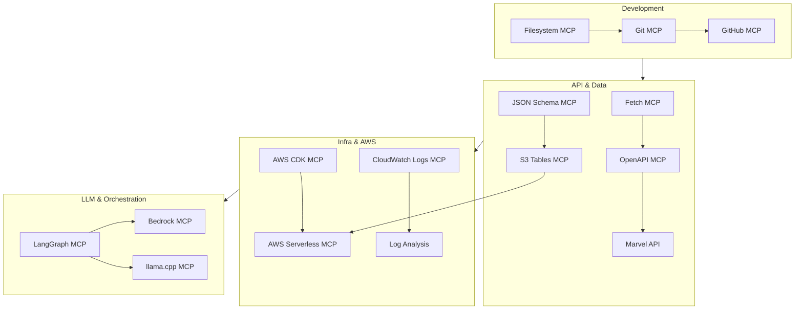

# MCP Servers for Ultron Embeddings Project

Model Context Protocol (MCP) is an open standard that lets AI models use external tools and services through a unified interface. In VS Code, MCP servers extend GitHub Copilot with direct access to files, APIs, databases, and cloud resources. 
For the **Ultron Embeddings Project**, MCP servers accelerate development across Rust, Python, and AWS stacks, while keeping everything aligned with our ingestion, transformation, storage, and retrieval pipeline.

[TOC]

---

## What is MCP and Why Use It Here?

- **Contextual Power** — MCP servers give Copilot the ability to act on project files, APIs, and cloud services directly.  
- **Stack Coverage** — We combine Rust (Lambda retriever), Python (LangGraph orchestration), AWS (infra + storage), and Marvel API (data). MCP servers unify these moving parts.  
- **Developer Flow** — Instead of switching windows, Copilot can commit code, test Marvel API calls, validate JSONL schemas, or inspect S3 embeddings inside VS Code.  
- **Ultron’s Advantage** — As Ultron forged his adamantium chassis from studying Captain America’s shield, we forge this system by combining existing strengths into something more resilient.

---

## Quickstart in VS Code

1. **Enable MCP Support**  
   - VS Code ≥ 1.102 with GitHub Copilot installed.  
   - Ensure `"chat.mcp.enabled": true` in your settings.  

2. **Install MCP Servers**  
   - Add configs via `.vscode/mcp.json` (see example below).  
   - Or run from CLI:  
     ```bash
     code --add-mcp "{\"name\":\"fetch\",\"command\":\"uvx\",\"args\":[\"mcp-server-fetch\"]}"
     ```

3. **Trust Servers**  
   - First time you start an MCP server, VS Code will prompt for trust. Confirm only for trusted sources.  

4. **View Installed Servers**  
   - Run `MCP: Show Installed Servers` (⇧⌘P → search).  

5. **Switch to Agent Mode**  
   - Open Chat (⌃⌘I), choose **Agent Mode**.  
   - Click **Tools** to select MCP tools. You can toggle on/off per session.  

6. **Reset Cached Tools if Needed**  
   - Run `MCP: Reset Cached Tools` if your updates don’t appear.  

7. **Verify**  
   - Run a Marvel API test through Fetch MCP.  
   - Inspect embeddings in S3 with S3 Tables MCP.  
   - Tail Lambda logs with CloudWatch MCP.  

---

## Best Practices for VS Code Integration

- **Trust Carefully** — MCP servers can run arbitrary code. Only add trusted sources, review configs before enabling.  
- **Secrets Management** — Use `${input:var}` placeholders in `.vscode/mcp.json`. Never hardcode API keys (Marvel, AWS).  
- **Sync Across Devices** — Enable Settings Sync so MCP configs travel with you.  
- **Tool Sets** — Group related tools (Rust dev, AWS infra, data validation) for efficiency.  
- **Limit Tool Count** — Copilot supports 128 active tools max. Keep configs lean.  
- **Reset Often** — Use `MCP: Reset Cached Tools` if tools don’t refresh after config changes.  

---

## Core Development Servers

- **Filesystem**  
  Access to project files for search, edits, and validation. Ensures Copilot agents can operate directly on the repository.  
  *Extended use:* enforce `/docs` structure and validate JSONL schema conformance.

- **Git (local)**  
  Provides staging, commits, diffs, and branch management inside Copilot. Example: `@cyanheads/git-mcp-server`.

- **GitHub (remote)**  
  Official server for issues, pull requests, and repository interactions. Enables Copilot to manage PRs and code reviews.  
  *Extended use:* enforce PR templates (Marvel attribution reminder, CI checks).

---

## AWS and Infrastructure Servers

- **AWS Knowledge / Documentation**  
  Live access to AWS SDK docs for **Rust** and **Python**. Useful for Bedrock embeddings, S3 interactions, and Lambda integration.

- **AWS CDK MCP**  
  Generates and validates CDK stacks for S3 buckets, vectors, and Lambda infra.

- **AWS Serverless MCP**  
  Focused on Lambda + SAM deployment workflows.

- **S3 Tables MCP**  
  Inspect JSONL artifacts stored in S3, verify embedding outputs, and preview schema compliance.

- **CloudWatch Logs MCP**  
  Tail and inspect Lambda logs directly in VS Code.

- **X-Ray MCP**  
  Visualize traces across ingestion → retrieval → orchestration.

---

## API and Data Handling Servers

- **OpenAPI MCP Server**  
  Generates tools from OpenAPI specs. When the Marvel API is wrapped in an OpenAPI schema, this server can auto-generate endpoint calls.

- **Fetch/HTTP Server**  
  General-purpose HTTP request helper for testing Marvel API signatures and responses before embedding into Rust client code.

- **JSON Schema MCP**  
  Validate JSON/JSONL records against defined schemas (`character`, `comic`, `event`). Ensures malformed records don’t break ingestion.

---

## Orchestration and LLM Servers

- **LangGraph MCP**  
  Simulate orchestration flows, test node logic, and validate tool wiring locally.

- **Bedrock MCP**  
  Run prompts against Bedrock foundation models from within VS Code.

- **llama.cpp MCP (optional)**  
  Local endpoint parity testing with quantized models for offline validation.

---

## Security and Secrets

- **Secrets MCP**  
  Validate `.env` contents, AWS profiles, and confirm no secrets are committed to Git. Lint repo for potential leaks.

---

## Configuration Example: `.vscode/mcp.json`

```json
{
  "servers": {
    "filesystem": {
      "command": "npx",
      "args": ["-y", "@modelcontextprotocol/server-filesystem"],
      "env": {
        "MCP_FS_ALLOWED_DIRS": "${workspaceFolder}"
      }
    },
    "git-local": {
      "command": "npx",
      "args": ["-y", "@cyanheads/git-mcp-server"]
    },
    "github-remote": {
      "type": "http",
      "url": "https://api.githubcopilot.com/mcp"
    },
    "aws-knowledge": {
      "type": "http",
      "url": "https://aws.amazon.com/mcp/knowledge"
    },
    "aws-cdk": {
      "type": "http",
      "url": "https://awslabs.github.io/mcp/cdk"
    },
    "s3-tables": {
      "type": "http",
      "url": "https://awslabs.github.io/mcp/s3-tables"
    },
    "cloudwatch-logs": {
      "type": "http",
      "url": "https://awslabs.github.io/mcp/cloudwatch"
    },
    "openapi": {
      "command": "uvx",
      "args": ["mcp-openapi-server"]
    },
    "fetch": {
      "command": "uvx",
      "args": ["mcp-server-fetch"]
    },
    "json-schema": {
      "command": "uvx",
      "args": ["mcp-json-schema"]
    },
    "langgraph": {
      "command": "uvx",
      "args": ["mcp-langgraph"]
    },
    "bedrock": {
      "command": "uvx",
      "args": ["mcp-bedrock"]
    },
    "llama": {
      "command": "uvx",
      "args": ["mcp-llama"]
    },
    "secrets": {
      "command": "uvx",
      "args": ["mcp-secrets"]
    }
  },
  "inputs": [
    { "name": "GITHUB_TOKEN", "description": "Token for GitHub MCP", "required": true },
    { "name": "AWS_PROFILE", "description": "Profile for AWS MCP servers", "required": false }
  ]
}
```

---

## Mapping to Project Next Steps

1. **Rust Client (Marvel ingest)**  
   - Test Marvel API signatures with Fetch/OpenAPI MCP.  
   - Validate JSON shape with JSON Schema MCP.  

2. **JSONL Embedding Logic**  
   - Filesystem MCP validates structure and schema.  
   - S3 Tables MCP inspects and previews JSONL artifacts.  

3. **S3 Integration**  
   - AWS Knowledge MCP confirms Rust/Python SDK snippets.  
   - CloudWatch Logs MCP monitors Lambda events post-deploy.  

4. **Infrastructure Setup**  
   - AWS CDK MCP provisions `ultron-embeddings-<account-id>` stack.  
   - X-Ray MCP (future) for distributed trace debugging.  

5. **Retriever**  
   - Rust Lambda tested with CloudWatch MCP.  
   - LangGraph MCP simulates retrieval orchestration.  

6. **Orchestration**  
   - LangGraph MCP validates node logic.  
   - Bedrock MCP tests system prompts; llama.cpp MCP for offline parity.  

7. **Testing & CI**  
   - GitHub MCP enforces PR templates and attribution checks.  
   - Git MCP ensures local correctness before push.  

8. **Security & Secrets**  
   - Secrets MCP confirms `.env` hygiene and prevents key leaks.  

---

## MCP Ecosystem Diagram



---

## Notes

- GitHub Copilot agent mode supports tool-based MCP servers; OAuth-based flows may require extra setup.  
- AWS MCP servers provide maintained endpoints for CDK, Serverless, and S3-focused workflows.  
- `.vscode/mcp.json` should be versioned; secrets provided through `.env` or secure prompts.  

---

### Reference Links

- [Marvel API](https://developer.marvel.com/)  
- [Ultron Embeddings Repo](https://github.com/BryanChasko/ultron-embeddings)  
